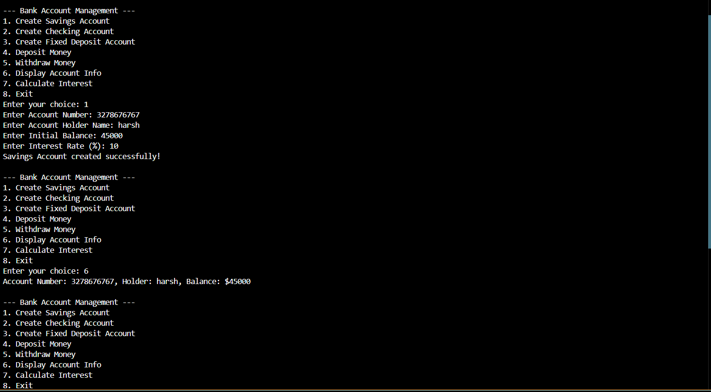

<h1 align="center">Banking System using C++</h1>
 

<h3 align="center">Develop a simple banking system that demonstrates the concepts of polymorphism,
encapsulation, and inheritance. The system should allow users to create different types of bank
accounts, perform transactions, and retrieve account information.</h3>
 

<h1 align="center">Banking System</h1>
 

 

>

